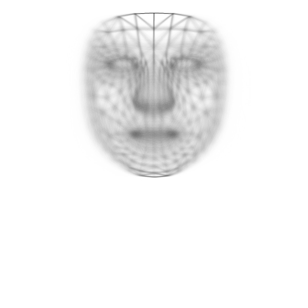
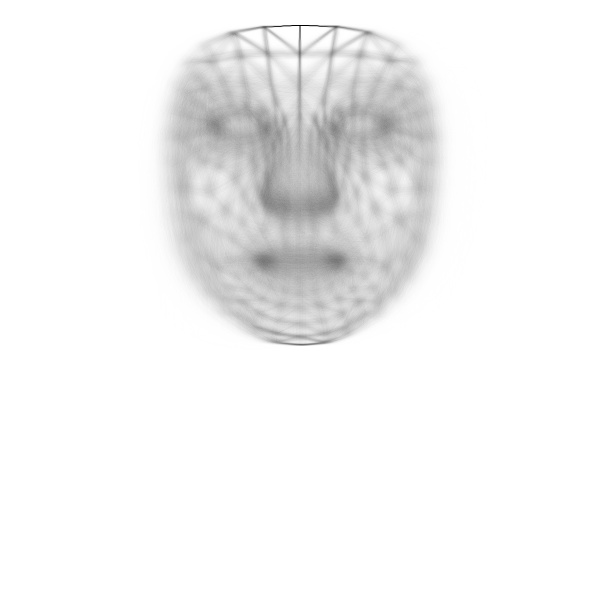
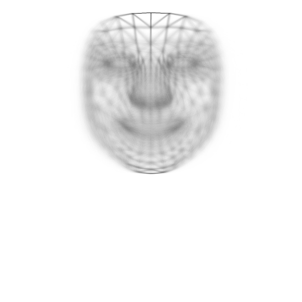

# Experimento 1 - Analisar os rostos com o mediapipe e salvar os dados das posições dos Landmarks

Será analisada cada imagem de cada pessoa em cada uma das expressões e o resultado será salvo na pasta processed da seguinte forma:

```
.
├── /processed
|   |
│   ├── /face_points
│   |   |
│   |   ├── [id_expressão]
│   |   |   |
|   |   |   ├── mean_[id_expressão].png (Mascara com triangulos fantas da expressão com fundo branco)
│   |   |   ├── [id_supervisionado]
│   |   |   |   ├── [id_pessoa]
│   |   |   |   |   |
│   |   |   |   |   ├── [id_foto].csv (vai conter as posições xy dos landmarks da foto)
│   |   |   |   |   ├── [id_foto].jpg (Mascara de triangulos da pessoa com fundo preto pra cada foto)
│   |   |   |   |   ├── mean_[id_pessoa].jpg (Mascara de triangulos fantasma da pessoa com fundo branco)

```

## Procedimentos

Para melhor analisar as imagens posteriormente um padrão será adotado, e ele será o seguinte:

- Todas as imagens serão rotacionadas para que os olhos fiquem sempre na mesma linha (alignEyes)
- O ponto 10 é deixado sempre na altura 25 e no centro da imagem, com a distancia entre o ponto 10 e o ponto 152 sendo de 320px (alignFace)
- A imagem será recortada em um retangulo, deixando apenas o rosto centralizado, com margem de 25px.
- A imagem será deixada com 600px X 600px sem redimensionar, apenas colocando bordas pretas nas laterais e em baixo para completar o tamanho
- somente então será salva com os dados relativos a imagem no fim deste processo.


## Remoções do Dataset

### Número incorreto de fotos em uma pasta do usuário

nos casos em que foi detectado que uma das pastas do usuário continha um numero diferente de 3 fotos, todas as pastas dele foram removidas da analise.
Os usuários que esta regra foi aplicada são os que seguem, com as seguintes observações:

- 00541 - 4 imagens em 00/00
- 02069 - 11 imagens em 00/00
- 05669 - 7 imagens em 00/00
- 06644 - 2 imagens em 00/00

## Exemplo de Máscara gerada com os Landmarks obtidos

<p align="center">

</p>

## Resultado das médias de cada expressão

|                                                                                                                |                                                                                                                |                                                                                                                |                                                                                                                |
| -------------------------------------------------------------------------------------------------------------- | -------------------------------------------------------------------------------------------------------------- | -------------------------------------------------------------------------------------------------------------- | -------------------------------------------------------------------------------------------------------------- |
| </br> <p align="center">00</p> | </br> <p align="center">01</p> | </br> <p align="center">02</p> | </br> <p align="center">03</p> |
| </br> <p align="center">04</p> | </br> <p align="center">05</p> | </br> <p align="center">06</p> | </br> <p align="center">04</p> |
